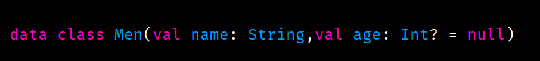
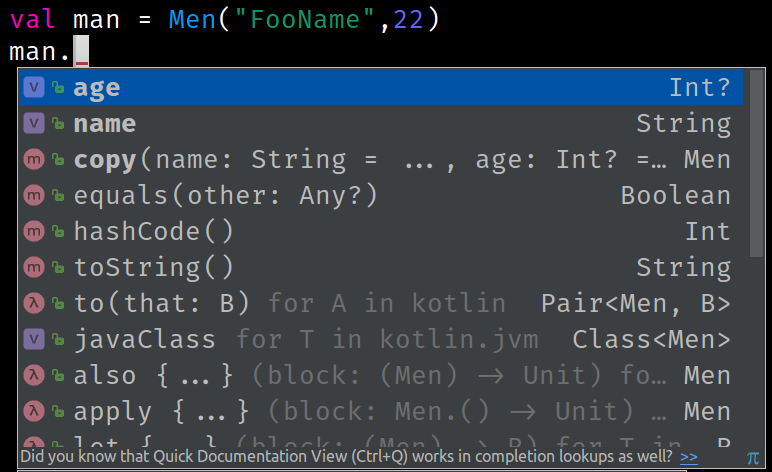
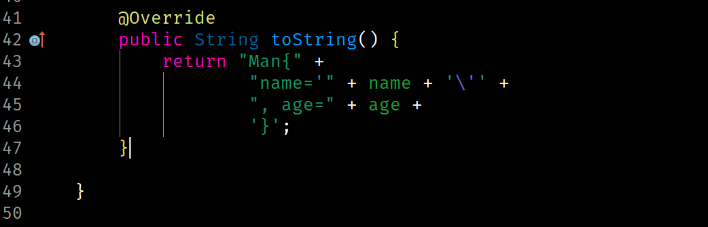
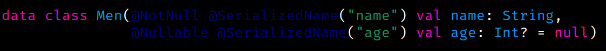
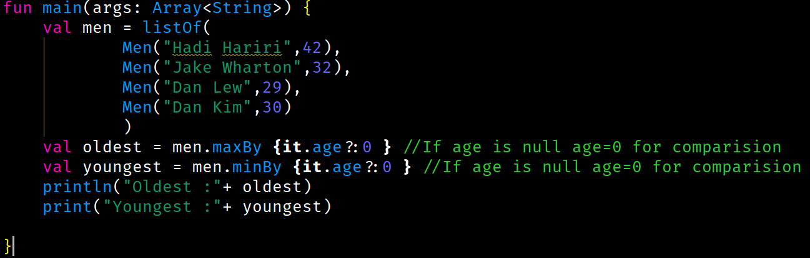
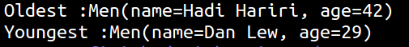

Do you remember the **POJO** (Plain Old Java Object) classes in Java? They had member variables, getters, setters, overridden toString(),hashCode() and copy() etc. methods. Well Kotlin `data class` does it all for you for free. We won't even have to use some cleaver IDE shortcuts. All you have to do is type data before the keyword class.

Not Only that, You can also use most of the java variable annotations if not all. If you use `GSON` from google, the following class will act exactly like a **GSON POJO** class. Is not that awesome?

which could take no less than 50 lines of code in Java for the complete `POJO` setup.

Not Only that, You can also use most of the java variable annotations if not all. If you use `GSON` from google, the following class will act exactly like a GSON POJO class. Is not that awesome?

Not exactly a data class feature but when we use it with some cool kotlin features like `lambda` to find the oldest and youngest, it looks even cooler like this :

And the Output looks Something like this :

That is all for this time. Thanks for following through
---