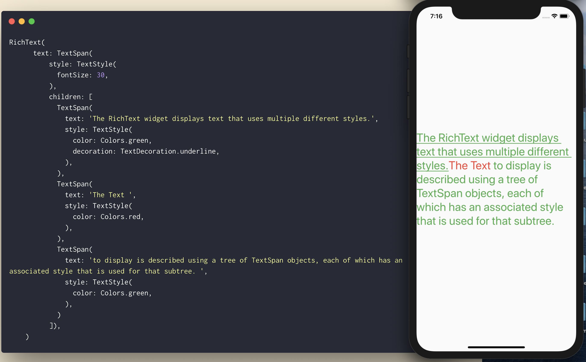

## #Day1 `stless` & `stful`.

We can type `stless` and `stful` and we get Autocomplete Suggestion to generate Stateless Flutter Widget or Stateful Flutter Widget Respectively.

 

## #Day2 `If Null` Operator (`??`).

`??` checks If something is `null`. If it's not null it returns it's own value but if it's `null` it returns the value after `??` 

`return abc??10;     //reutrns 10 if abc is null else returns it's own value,` 

It also has shorthand assignment when it's null.

`abc??=5     //assigns 5 to abc if it's null`

## #Day3 Inner Function.

We can define a function inside another function. 

This is to encapsulate the inner function from everything else outside the outer function.

---

## #Day4 ..Cascade..Chaining..Fluent API

We can chain method/member calls without returning `this` from **method(), getter() and setter()** using cascade operator (..)

try in [Dartpad](https://dartpad.dartlang.org/290e17306b745ed83b9242653ca55041)

Can be replaced with 

## #Day5 Dart `data class`

Dart does not support data class by default, but with plugins, we can simply generate data class (`copyWith()`,`fromMap()`, `toMap()`, `Named Constructor`, `toString()`,`hashCode()` & `equals()` methods implemented by the tool).

### `🚨❗️Caution❗️🚨` : **Your cursor should be inside the class that you want to generate data class.**

Download Plugins : 

[For Android Studio](https://plugins.jetbrains.com/plugin/12429-dart-data-class)

[For VsCode](https://marketplace.visualstudio.com/items?itemName=BendixMa.dart-data-class-generator)

## #Day6 RichText Widget

If you want to have a single text with different style within it? Do not bother or try to hack with with `Text()` and use `RichText()` with `TextSpan()`

[Try on dartpad](https://dartpad.dartlang.org/f87dddb2f48f1d1ef0f25903af1ded58)

[See Youtube Demo](https://www.youtube.com/watch?v=rykDVh-QFfw)

## #Day7 Spacer Widget

Using Container with certain height/width to create responsive space between Widgets? That may look good on one screen but will not look the same in different screen size. 

Spacer Widget comes for the rescue. Instead of `Container(width: / height: )`, use `Spacer(flex: )`. 

How on this earth did I not know about this widget earlier? This is going to save many lives 😂

[Try on dartpad](https://dartpad.dev/f0d077124527a8078cdb2eede1e9bf73)

[See Youtube Demo](https://www.youtube.com/watch?v=7FJgd7QN1zI)

