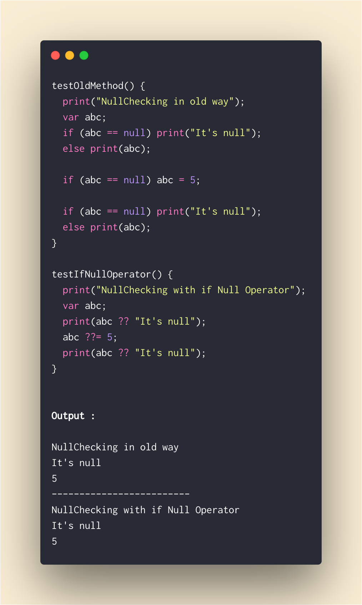
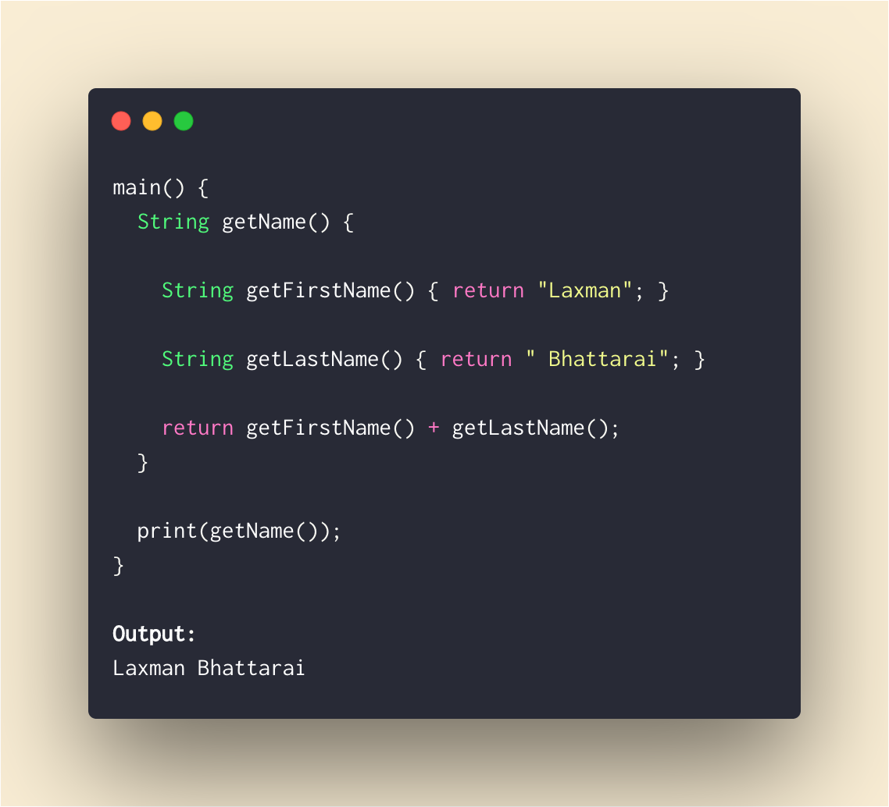
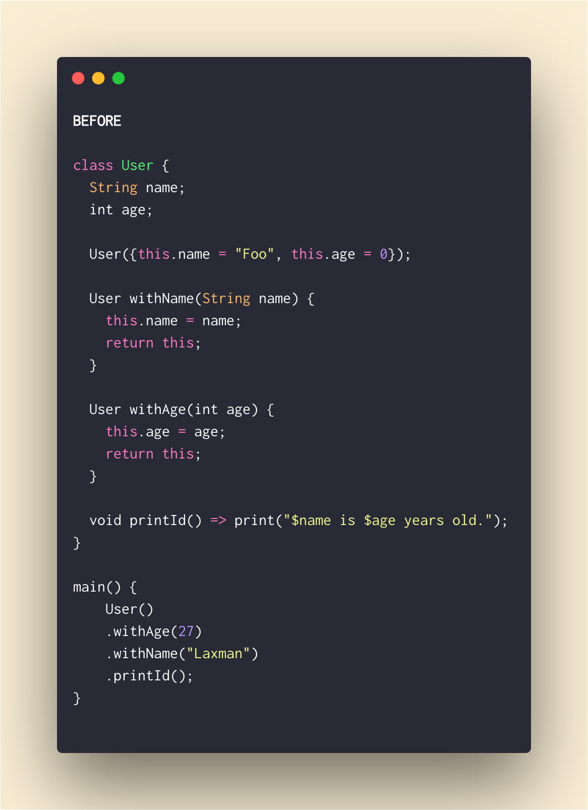
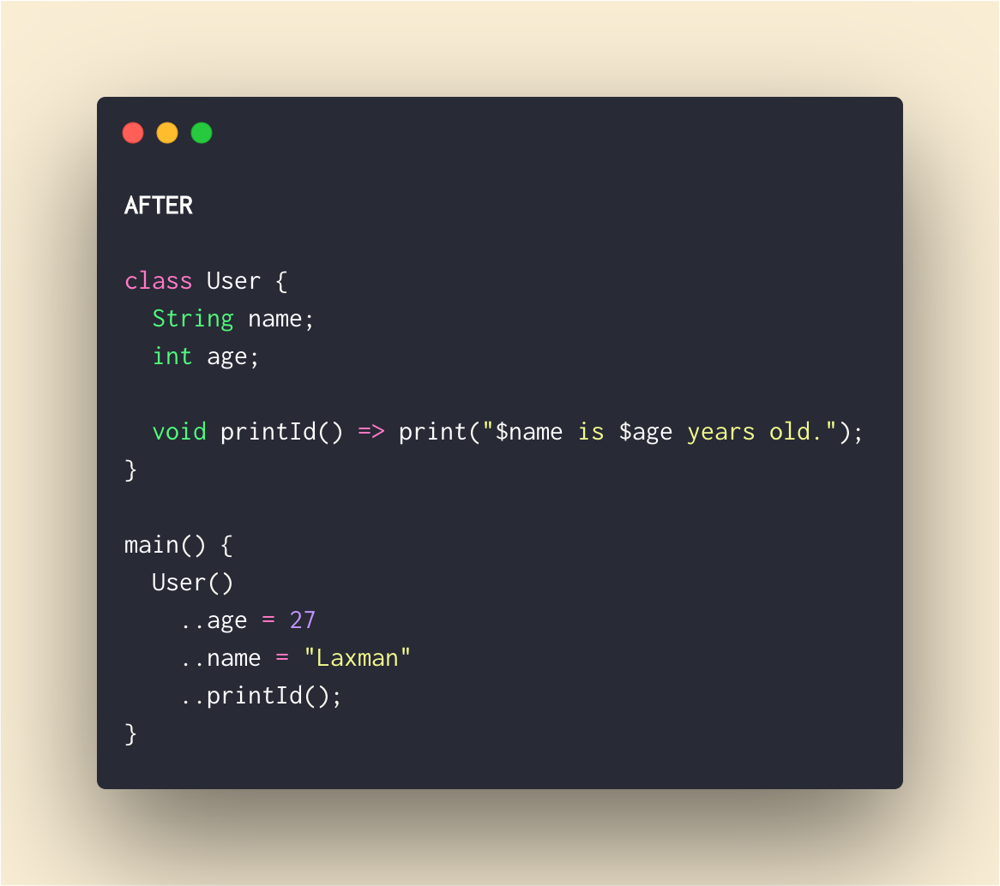

# Draft

## #Day1 `stless` & `stful`.

We can type `stless` and `stful` and we get Autocomplete Suggestion to generate Stateless Flutter Widget or Stateful Flutter Widget Respectively.

 

## #Day2 `If Null` Operator (`??`).

`??` checks If something is `null`. If it's not null it returns it's own value but if it's `null` it returns the value after `??` 

`return abc??10;     //reutrns 10 if abc is null else returns it's own value,` 

It also has shorthand assignment when it's null.

`abc??=5     //assigns 5 to abc if it's null`

## #Day3 Inner Function.

We can define a function inside another function. 

This is to encapsulate the inner function from everything else outside the outer function.

---

## #Day4 ..Cascade..Chaining..Fluent API

We can chain method/member calls without returning `this` from **method(), getter() and setter()** using cascade operator (..)

try in [Dartpad](https://dartpad.dartlang.org/290e17306b745ed83b9242653ca55041)

Can be replaced with 

