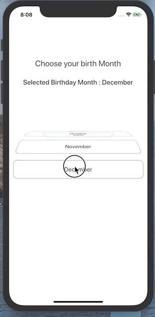
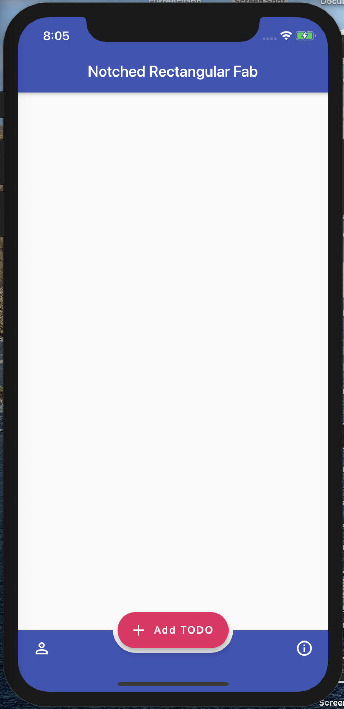
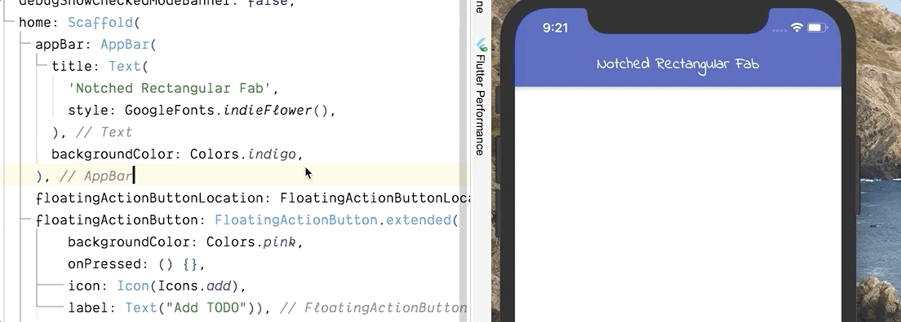

## #Day22 Callable class

In flutter we can call instance of a class like we call method. 

What you have to do is defile a `call()` method of any return type or arguments. that `call()` method will be called when you call the instance.

    void main() {
        var member = CallableClass();
        member("Flutter");
    }

    class CallableClass{
        call(String name){
            print("Name is $name");
        }
    }

[try in dartpad](https://dartpad.dartlang.org/294c4973aeab2b8312e415ce4dc55799)

## #Day23 ListWheelScrollView

We can implement following Wheel List using `ListWheelScrollView` in flutter.

Just give it the children and it will start working for you. 

You can customize the wheel with Constructor arguments of `ListWheelScrollView` play with them.

    ListWheelScrollView(
        children: <Widget>[
            ..Children Widgets
        ],
    )

[try on dartpad](https://dartpad.dartlang.org/a30529134eb181507207f305b2bf6201)

[try on codepen](https://codepen.io/erluxman/pen/NWGjBjX)

## #Day24 Rectangular Fab with Notched Bottom Appbar.

Circular notched Buttom Bar with Fab is cool 

**BUT**

Ever wanted rectangular Fab with Notch? 

`FloatingActionButton.extended` with `BottomAppBar`'s `shape` as `AutomaticNotchedShape` like this: 

    shape: AutomaticNotchedShape(
            RoundedRectangleBorder(),
            StadiumBorder(
              side: BorderSide(),
            ),
          ),
[try this code on your editor](https://gist.github.com/erluxman/fd442639bcaf84e14b31f70b00c48fe9)

## #Day25 Google Fonts in flutter

With the pub.dev package `google_fonts` you can use any google fonts without downloading them.

Just give the textStyle as any google fonts.

Want to set other textStyles properties? Just provide `textStyle` to the font (Which is a textStyle itself)

    Text(
        'Notched Rectangular Fab',
        style: GoogleFonts.pacifico(
            textStyle: TextStyle(color: Colors.red),
        ),)

[try on pub.dev](https://pub.dev/packages/google_fonts)

## #Day26  Hero Animation (Shared Element Transition)

### **Do you want your Widget/Image to fly from one screen to another?**

Flutter makes it super easy to do **Shared Element / Hero animation** with Widget called `Hero`.
Just give **same `tag`** for the `Hero` widget in both screen and your Widget will start flying from one screen to another.

Caution : Do not give a static stiring as tag if your UI has dynamic data like List, use a value of object like title,id etc as tag 

    //First Screen

    FirstPageWidget extends StatelessWidget{                      
    return Scaffold(
        ...
        Hero(
            tag: player.name
            child: Image.network(url)
        )
        //Other player List
        ...
        );
    }

    //Second Page

    SecondPageWidget extends StatelessWidget{
    return Scaffold(
        ...
        Hero(
            tag: player.name
            child: Image.network(url)
            )
        //Player details
        ...
        );
    }

[try on Codepen](https://codepen.io/erluxman/pen/eYpEjoQ)

For better experience : Decrease the browser width

