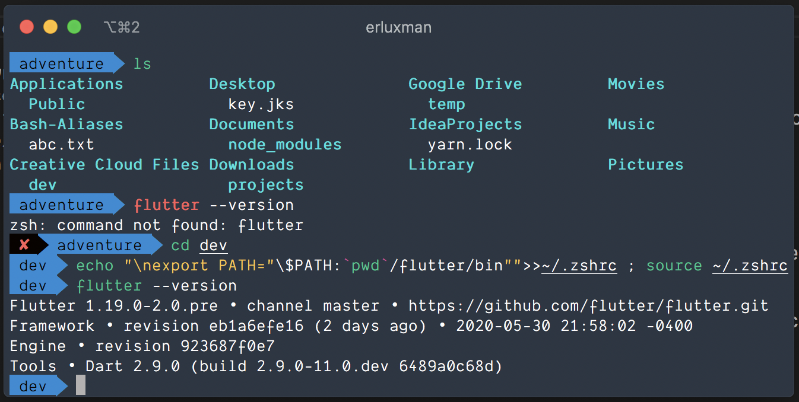

## #Day57 typedef

`typedef` is used when you want to give an alias to a **`Function signature`**. As it can be laborous and error prone to type the Function Signature in every field or return type. As a bonus, we do not lose Function's type info.

__`Steps to use typedef:`__

Step 1 : Define a `typedef`  with Function Signature __`outside a class`__.

        typedef UserSelector = User Function(String, String);

Step 2 : Replace the Function Signature with typedef to declare members or return type.
        
    class A{
        //Use this ✅
        UserSelector userSelector;

        // Not this ❌
        User Function(String, String) userSelector;

        A ({this.userSelector});
    }

Step: Simply pass function/ lambda like you did before.
    
    //Pass lambda 
    var a = A(userSelector: (id, authKey) {
      return User(id, "User name");
    });

    //Pass Method
    var a = A(userSelector: getUser)

    User getUser(String id, String key) {
        return User(id, "User name");
    }

## #Day58 Easy 

Still confused installing flutter in mac/linux easily?

1. Download Flutter zip.
2. Decompress it in desired directory.
3. `cd` to that desired directory from terminal.
      [🚨⚠️ flutter should be inside desired directory]
4. Run the following command  

        If you are using zsh:
        echo "\nexport PATH="\$PATH:`pwd`/flutter/bin"">>~/.zshrc ; source ~/.zshrc

        If you are using bash:
        echo "\nexport PATH="\$PATH:`pwd`/flutter/bin"">>~/.bashrc ; source ~/.bashrc
