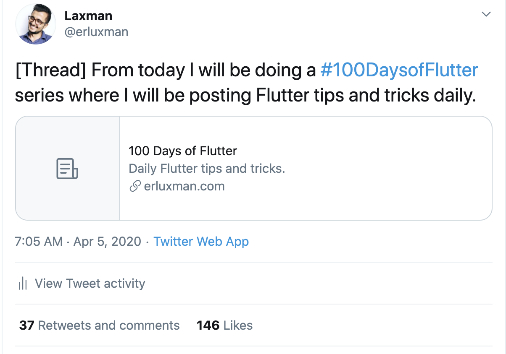
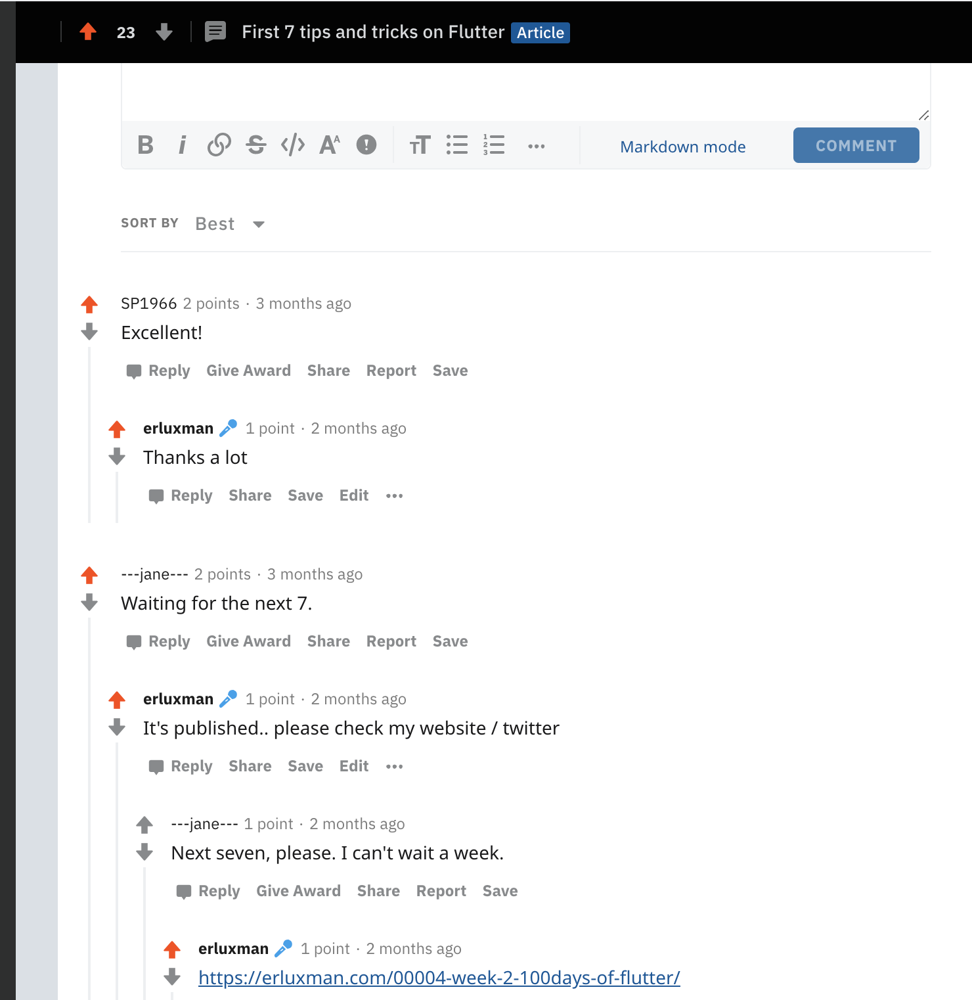
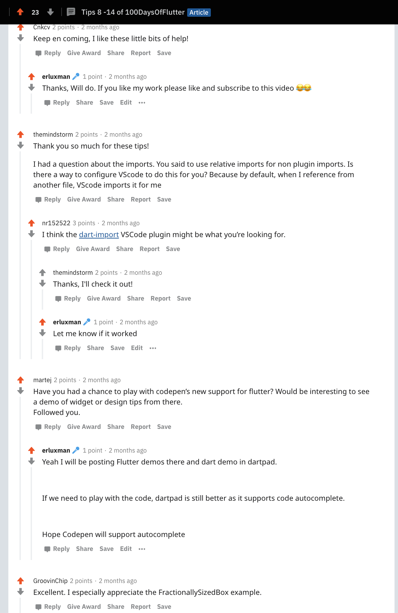
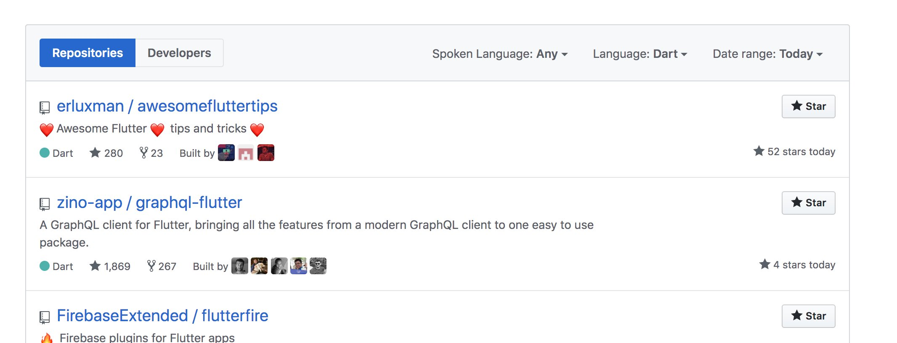
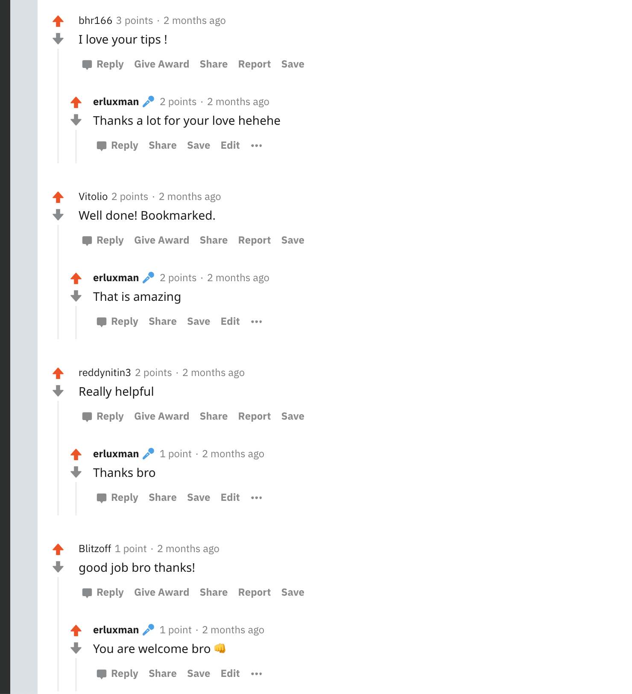
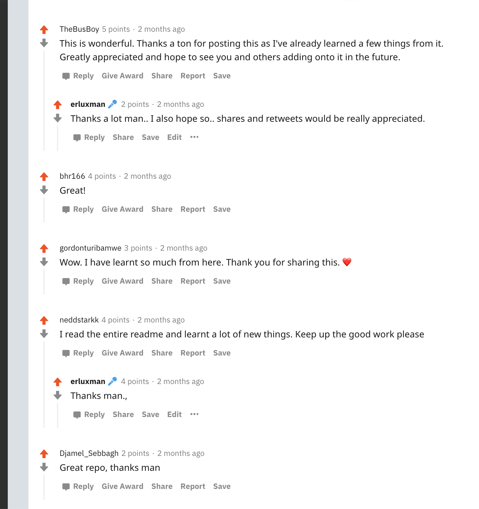
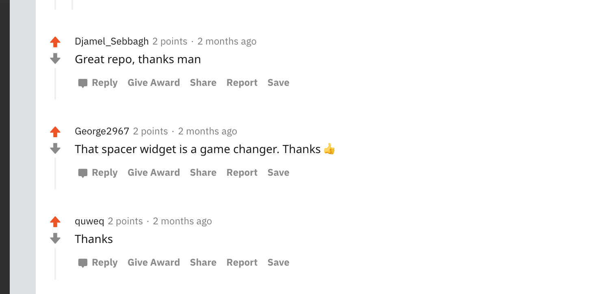
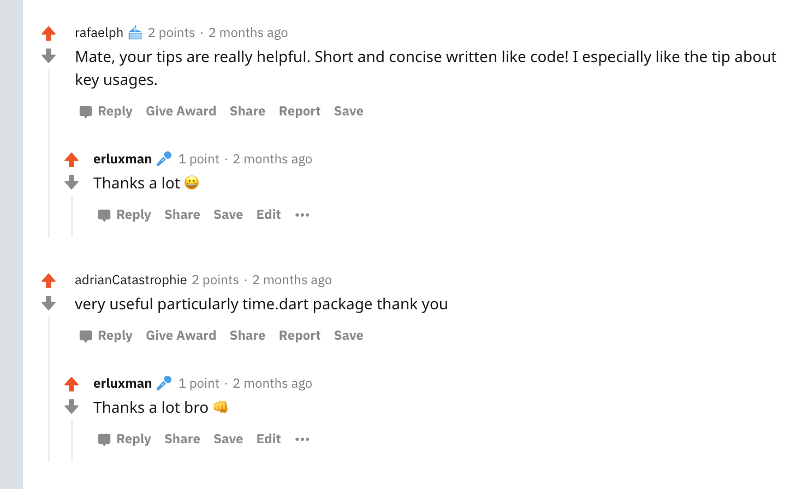
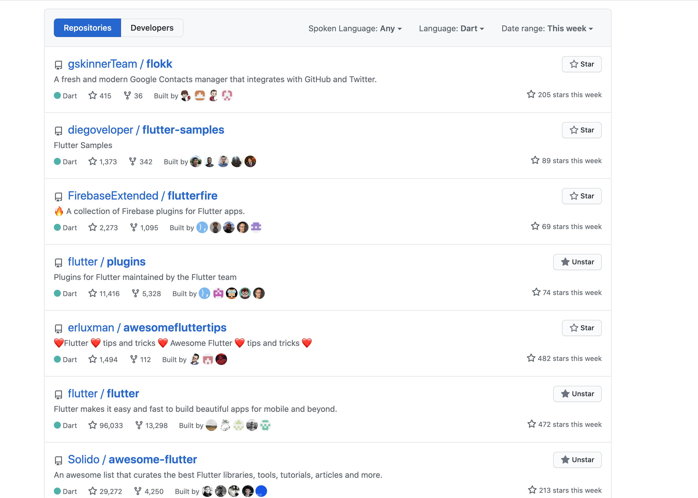
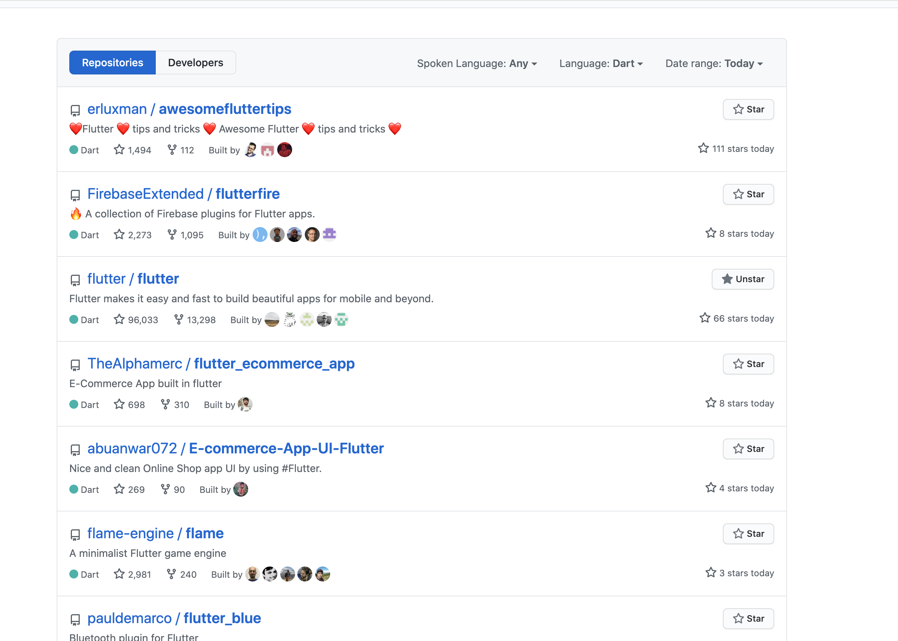

## My best 100 days as a developer

On **April 5th 2020**, exactly **100** days ago, I publicly announced on twitter that I will be posting Flutter tips and tricks everyday for 100 days.

### Apr 5 - May 4

I officially started posting tips on Twitter in a [thread](https://twitter.com/erluxman/status/1246608678486065152). I was planning to publish tips for sometime but haven't really started. So, I wanted to officially kick start the journey and keep myself committed to it by keeping myself publicly accountable within my twitter circle.

I started posting daily tips in twitter and a blog of 7 tips at once on my site erluxman.com every week & also shared the blog on reddit. At the beginning I didn't intend of building any helpful document. In fact I didn't even expect I would create something helpful by publishing tips. But I did just for the sake of being disciplined and being a man of words. I started to get good response on reddit about my blogs. I started getting  replies like "nice tips", "Waiting for next 7 tips". It kinda gave me a extra push to keep going.

| |    |
|--|--|

### May 5

On `May 5` i.e. on the 28th day I decided to merge all the tips into a Github Repo called [Awesome Flutter Tips and Tricks](https://github.com/erluxman/awesomefluttertips).

The repo got well received and it was trending in **#1 in Github** under `dart 🎯` language the other day(Which I only found later). In fact it was trending in #1 multiple times over last 100 days, which was a really big thing for me as The most ★ I ever got on repo was around 5. I felt like I was was right path doing all these tips. I also got many amazing comments about th
e repo.

|||
|--|--|
|||

#### May 6 - July 13

As I was posting tips everyday, I missed posting in 2 different days due to power and network issue in my area but covered that delay the next days.

As the days went by it became harder to find good tips and it sometimes took me more than 5 hours to publish a tip.

I kept getting awesome replies and started getting messages on my Twitter DM for help, which I tried my best. Most of them were beginner folks in Flutter. One of the guys who messaged me just got hired yesterday 🚀. I feel really really happy for him 👍🏻.

In this period I also published a plugin [pdf_flutter](https://pub.dev/packages/pdf_flutter) to render PDF files in Android & iOS, which was also received considerably well. This was needed for my job and I spent sometime to make it publishable as plugin.

I also tried to do live coding of a Habit Management / Todo app but I couldn't manage time for daily live coding and tips collection. I am going to do live coding in days.

#### July 14 (The 100th day)

It was an amazing coincidence that my 100th tip was going to published exactly on my birthday, I didn't plan it.
After I completed all 100 tips that I initially targeted,
My repo was was being starred even more than Flutter itself across the whole week.
|||
|--|--|

#### Tips vs Article

When I started to post tips, I want to cover every important topic. But as I went with the journey, I discovered that there are certain stuffs which can never be taken as a tips and they must be a detailed Article to properly introduce to developers.

A tips is very specific for a use case and usually something that can be understood when we look at it without significant cognitive effort and makes you feel smart 😉. Finding topic was easy but converting them to a valid tips took real effort. I sometimes spent hours trying to reduce the words and details so that it looks like a proper tips.

There are still more than 100 other topics in my backlog that I wanted to make tips of. I tried to make tips about many of those topics but I wasn't satisfied how they came out as most of them required considerable amount of details that needed to be an article.

#### What I learned?

I was a student of habit before I stared this series but I was not familiar with Open-source. I kinda knew that **public accountability** "**works**" as I had woken up and went for run before 5 AM for more than 120 days in a row with the help of same principle.

What I learned in this period is more about open-source. I didn't even consider my repo as open-source project as it wasn't a typical project which can be compiled & run. Then as I kept getting the response I got, I realized **`Oh so this is also open source project 💡😎`**. Then it gave me confidence to release a `pdf_flutter` plugin to render PDF in Flutter UIs. It also taught many other ways I could contribute to open-source. 

#### What's next?

I will be writing tips (though not daily) in future. I will also write article about the topic that I couldn't fit into the repo as a tips and other important topics like State management, Code generation, Effective List, Animation, Drawing, Efficient UI rendering etc.

I will resume live coding on my [Youtube Channel](https://youtube.com/channel/UCrNwm2ZAfqF0gfPv4hrxGNg) from 6:AM IST for 2-3 hours on daily basis from July 18, 2020 for at least 300 days in one year building real Application (Todo/Habit management). I will start from scratch, publish to app stores, fix the bugs & even do any necessary marketing / design strategy in live coding. Completely and literally open-source. I hope to get feedback to make this project a success. Wish me luck 🙏🏼

I am also working on publishing an utility package for doing easy and obvious stuffs in Flutter & dart that can help developers speedup the development and jump past minor issues that kill time and give headache. Basically a package with amazing tips already implemented, ready to be used. But I cannot provide a exact date or approximation on this project as I might not have realized how big it is actually gonna get.

### That's it for today, Thank you 🙏🏼

